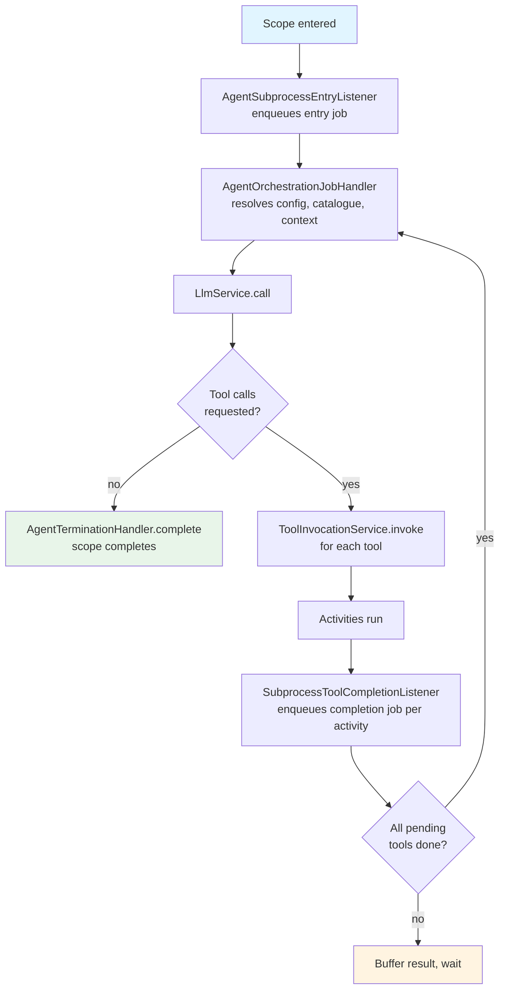

# agent-orchestrator

Drives the per-turn loop for an agentic subprocess: calls the LLM, dispatches the tool activities it requests, collects the results, and repeats until the model returns no further tool calls, at which point the scope is completed.

## Responsibilities

- Registers a BPMN parse listener that attaches execution listeners to ad-hoc subprocesses annotated with `agent:config`
- Fires an asynchronous job on scope entry that begins the first LLM turn
- Fires an asynchronous job on each tool activity completion that feeds the result back and, once all pending tools are done, drives the next turn
- Manages per-execution agent state (conversation history, pending tool calls, result buffer) as process-local variables
- Completes the scope when the LLM returns a response with no tool calls

## Prerequisites

- `agent-config` must be on the classpath
- `agent-tool-context-discovery` must be on the classpath
- `agent-llm-connector` must be on the classpath (provides `LlmService`)
- `agent-tool-invocation` must be on the classpath (provides `ToolInvocationService`)

## Installation

```xml
<dependency>
    <groupId>org.finos.fluxnova.bpm</groupId>
    <artifactId>fluxnova-engine-plugins-ai-agent-orchestrator</artifactId>
</dependency>
```

Spring Boot auto-configuration activates automatically when `RuntimeService`, `LlmService`, and `ToolInvocationService` beans are all present. No further setup is required.

## How It Works

### At deployment

`AdHocAgentOrchestrationParseListener` scans subprocesses for `agent:config`. On each matching ad-hoc subprocess it attaches:

- A **start listener** (`AgentSubprocessEntryListener`) that enqueues the first orchestration job when the scope is entered
- An **end listener** (`SubprocessToolCompletionListener`) on each startable child activity that enqueues a tool-completion job when the activity finishes

### Per-turn loop



### State variables

The orchestrator stores all transient state as process-local variables on the scope execution. No external storage is required.

| Variable | Description |
|---|---|
| `_agentConversationHistory` | JSON-serialised list of conversation turns |
| `_agentPendingToolCalls` | JSON-serialised set of tool-call ids awaiting completion |
| `_agentToolResultBuffer` | JSON-serialised list of results received since the last LLM call |
| `_agentToolCallQueue` | JSON-serialised list of queued tool calls |

## Customisation

### Termination strategy

`AgentTerminationHandler` is an interface. Register a Spring bean to replace the default `AdHocSubprocessTerminator` with a different scope completion strategy:

```java
@Bean
public AgentTerminationHandler myTerminationHandler() {
    return scopeExecutionId -> { /* custom completion logic */ };
}
```

## Key Classes

| Class | Package | Role |
|---|---|---|
| `AgentOrchestrationJobHandler` | `...orchestrator.job` | Job handler that drives a single orchestration turn |
| `AgentStateManager` | `...orchestrator.state` | Reads and writes per-execution agent state as process variables |
| `AgentSubprocessEntryListener` | `...orchestrator.engine` | Execution listener that enqueues the first job on scope entry |
| `SubprocessToolCompletionListener` | `...orchestrator.engine` | Execution listener that enqueues a completion job when a tool activity ends |
| `AdHocAgentOrchestrationParseListener` | `...orchestrator.engine` | BPMN parse listener that attaches execution listeners at deployment |
| `AgentTerminationHandler` | `...orchestrator.service` | Interface for completing the scope when the loop ends |
| `AdHocSubprocessTerminator` | `...orchestrator.service` | Default termination handler; calls `completeAdHocSubProcess` |
| `AgentOrchestrationConfig` | `...orchestrator.model` | Job handler configuration distinguishing entry from tool-completion steps |
| `ToolResult` | `...orchestrator.model` | Outcome of a single tool activity execution |
| `AgentOrchestratorEnginePlugin` | `...orchestrator.engine` | `ProcessEnginePlugin` that registers the parse listener |
| `AgentOrchestratorAutoConfiguration` | `...orchestrator.autoconfigure` | Spring Boot auto-configuration |
