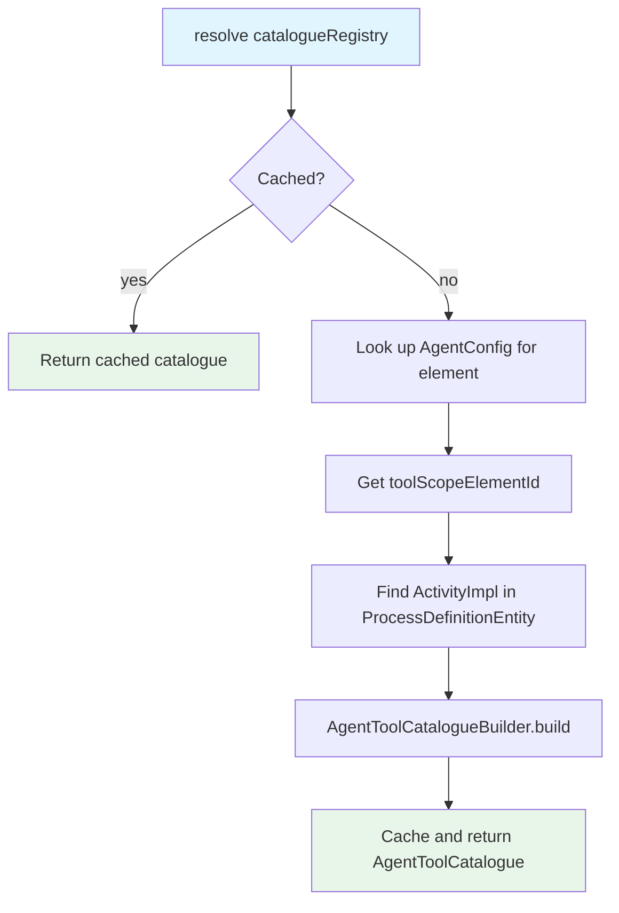
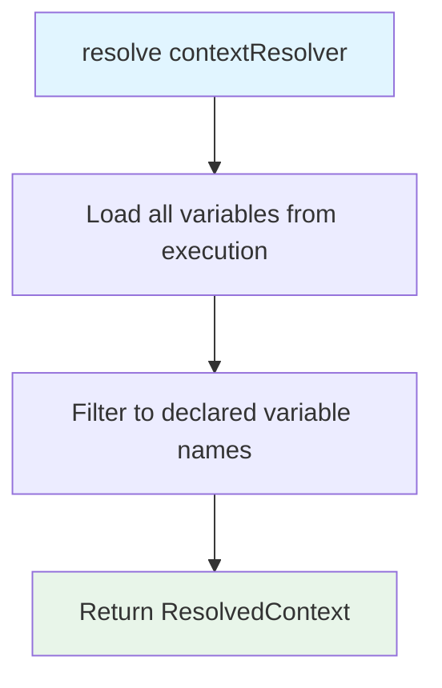

# agent-tool-context-discovery

Discovers the tool activities available within a BPMN scope element, extracts declared context variable specifications, and resolves runtime variable snapshots for a scope execution.

## Responsibilities

- Provides `AgentToolCatalogueRegistry` for on-demand lookup of the tool catalogue for a scope element; catalogues are built from the runtime activity model and cached per process definition
- Provides `AgentContextSpecRegistry` for on-demand lookup of the context variable declarations for a scope element
- Provides `AgentContextResolver` for resolving a filtered snapshot of process variables at runtime, based on a context specification
- Listens for process undeployment events and evicts stale cache entries
- Exposes `AgentToolCatalogueBuilder` and `AgentContextSpecBuilder` as extension points for custom catalogue and context extraction strategies

## Prerequisites

`agent-config` must be on the classpath — `AgentConfigRegistry` is used to locate the tool scope element id for a given agent element.

## Installation

```xml
<dependency>
    <groupId>org.finos.fluxnova.bpm</groupId>
    <artifactId>fluxnova-engine-plugins-ai-agent-tool-context-discovery</artifactId>
</dependency>
```

Spring Boot auto-configuration activates automatically when a `RepositoryService` bean is present. No further setup is required.

## BPMN Reference

### Tool activities

Child activities of the scope element are discovered automatically from the runtime activity model — no additional BPMN annotations are needed to make an activity a tool. The activity's `name`, `documentation`, and input/output mappings are used to populate the catalogue entry.

Input parameter expressions are inspected to infer which process variables the tool **reads**. Output parameter names are used to infer which variables the tool **writes**. These are informational hints included in the catalogue entry.

```xml
<bpmn:serviceTask id="lookupCustomer" name="Look Up Customer">
  <bpmn:documentation>Looks up a customer record by id.</bpmn:documentation>
  <bpmn:extensionElements>
    <camunda:inputOutput>
      <camunda:inputParameter name="id">${customerId}</camunda:inputParameter>
      <camunda:outputParameter name="customerName">${result}</camunda:outputParameter>
    </camunda:inputOutput>
  </bpmn:extensionElements>
</bpmn:serviceTask>
```

### Context variable declarations

Declare which process variables should be included in the context snapshot passed to each turn using an `<agent:context>` block in the scope element's extension elements:

```xml
<bpmn:adHocSubProcess id="myAgent">
  <bpmn:extensionElements>
    <agent:config provider="ollama" model="llama3"/>
    <agent:context>
      <agent:variable name="customerId"/>
      <agent:variable name="orderStatus"/>
    </agent:context>
  </bpmn:extensionElements>
</bpmn:adHocSubProcess>
```

Only variables listed here are included in the resolved context. If no `<agent:context>` block is present, the resolved context will be empty.

## How It Works

### Tool catalogue resolution



### Context resolution at runtime



## Customisation

Both catalogue building and context extraction are strategy interfaces. Register a Spring bean to override either default:

```java
@Bean
public AgentToolCatalogueBuilder myCustomCatalogueBuilder() {
    return scope -> { /* custom logic */ };
}
```

```java
@Bean
public AgentContextSpecBuilder myCustomContextSpecBuilder() {
    return (element, processDefinitionId) -> { /* custom logic */ };
}
```

## Key Classes

| Class | Package | Role |
|---|---|---|
| `AgentToolCatalogue` | `...discovery.model` | Immutable catalogue of tool entries for a scope |
| `AgentToolEntry` | `...discovery.model` | Single tool descriptor: id, name, description, reads, writes |
| `AgentContextSpec` | `...discovery.model` | Declared context variable names for a scope element |
| `ResolvedContext` | `...discovery.model` | Runtime snapshot of filtered process variables |
| `ContextVariableDeclaration` | `...discovery.model` | A single declared variable name |
| `AgentToolCatalogueBuilder` | `...discovery.extract` | Strategy interface for building a tool catalogue from an `ActivityImpl` |
| `AgentContextSpecBuilder` | `...discovery.extract` | Strategy interface for building a context spec from a BPMN element |
| `AdHocSubProcessCatalogueBuilder` | `...discovery.extract` | Default catalogue builder; reads child activities of an ad-hoc subprocess |
| `BpmnExtensionContextSpecBuilder` | `...discovery.extract` | Default context spec builder; reads `<agent:context>` extension elements |
| `AgentToolCatalogueRegistry` | `...discovery.registry` | Lookup and cache for tool catalogues |
| `AgentContextSpecRegistry` | `...discovery.registry` | Lookup and cache for context specifications |
| `AgentContextResolver` | `...discovery.runtime` | Resolves a filtered variable snapshot from a live execution |
| `AgentDiscoveryUndeployListener` | `...discovery.lifecycle` | Clears both registry caches on process undeployment |
| `AgentDiscoveryAutoConfiguration` | `...discovery.autoconfigure` | Spring Boot auto-configuration |
