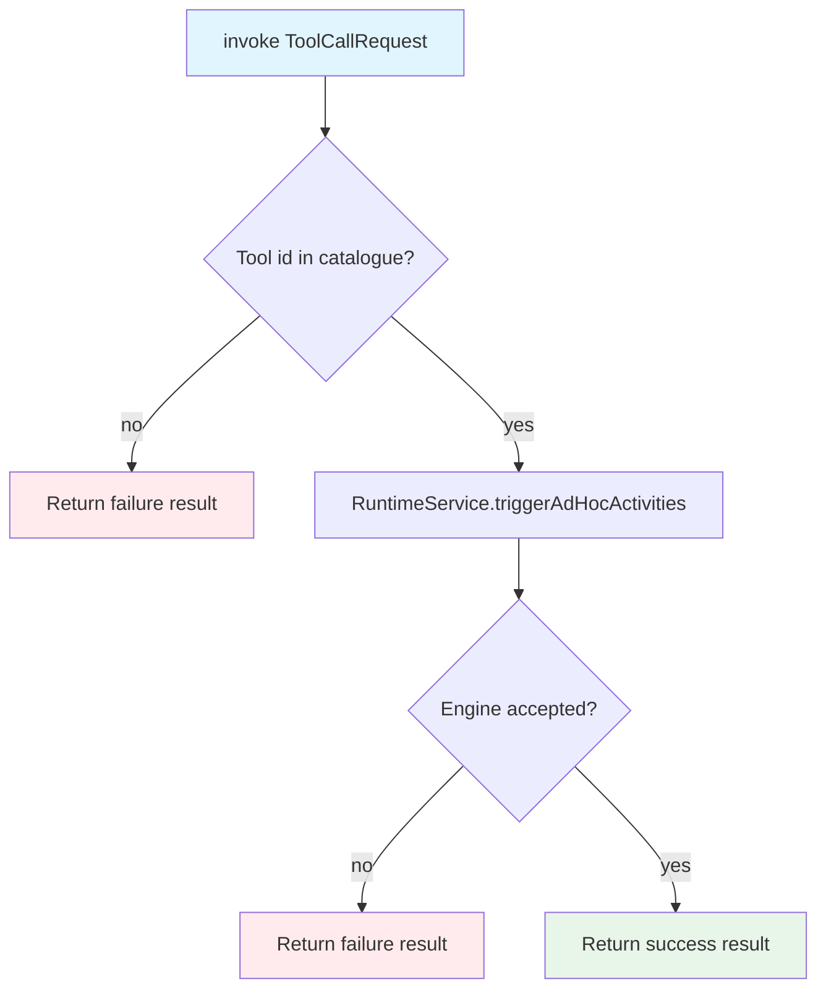

# agent-tool-invocation

Translates tool-call requests into process engine activity invocations within an ad-hoc subprocess scope.

## Responsibilities

- Provides `ToolInvocationService`, an interface for triggering a named tool activity within an ad-hoc subprocess scope
- Validates that the requested tool is present in the supplied catalogue before dispatching
- Returns a `ToolInvocationResult` indicating success or failure rather than throwing, allowing callers to handle errors uniformly

## Prerequisites

- `agent-tool-context-discovery` must be on the classpath (provides `AgentToolCatalogue`)

## Installation

```xml
<dependency>
    <groupId>org.finos.fluxnova.bpm</groupId>
    <artifactId>fluxnova-engine-plugins-ai-agentic-tool-invocation</artifactId>
</dependency>
```

Spring Boot auto-configuration activates automatically when a `RuntimeService` bean is present. No further setup is required.

## How It Works

`ToolInvocationService.invoke` validates the requested tool id against the catalogue, then triggers the corresponding activity within the ad-hoc subprocess scope using `RuntimeService.triggerAdHocActivities`. The invocation is **non-blocking**: the activity is started and the method returns immediately without waiting for the activity to complete.

The `_agentToolCallId` variable is set on the activity's local scope so that completion listeners downstream can correlate the result back to the original request.



## Customisation

`ToolInvocationService` is an interface. Register a Spring bean to replace the default implementation:

```java
@Bean
public ToolInvocationService myToolInvocationService(ObjectProvider<RuntimeService> runtimeService) {
    return (adHocSubprocessId, catalogue, request) -> { /* custom logic */ };
}
```

## Key Classes

| Class | Package | Role |
|---|---|---|
| `ToolInvocationService` | `...agent.service` | Interface for invoking a tool activity within a scope |
| `AdHocActivityToolInvocationServiceImpl` | `...agent.service` | Default implementation; triggers activities via `RuntimeService` |
| `AgentToolInvocationAutoConfiguration` | `...agent.autoconfigure` | Spring Boot auto-configuration |
